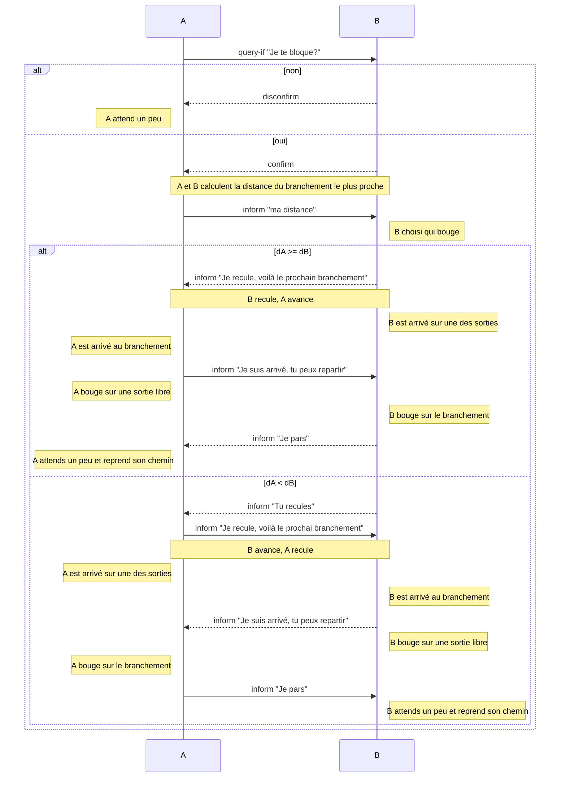

Our take/solution on the Dedale project, done during the "FOSYMA" teaching at Sorbonne University. We worked on the "Collect maximum amount of treasure" goal.

See below original readme taken from Dedale Project :

# Welcome to the Dedale project.

This project is developed at Sorbonne University, Paris, France. It is used in both research and teaching activities. Considering the later, during the FoSyMa course (from the French “Fondement des Systèmes Multi-Agents”) as a practical application of Multi-Agents Systems (MAS). 
It allows Master's students to obtain a first-hand experience of some of the nice (and sometimes difficult) characteristics that comes with agents and distributed systems :
 - distribution and asynchronism (system and communication),
 - autonomy, decision and coordination in uncertain and partially observable environments

**Your goal here is "simple", you have to conceive and implement the behaviours of a team of heterogeneous agents that have to explore an unknown environment and coordinate themselves to reach a given goal** :
 - To collect the maximum amount of treasure in a given time frame.
 - To hunt the Golem(s)
 - To patrol an area
 - To pick and deliver packages
 
while facing, or not, other teams.

This game is initally inspired by the famous "Hunt the Wumpus"  of [Gregory Yob](https://en.wikipedia.org/wiki/Gregory_Yob).

For more details, see Dedale's website : https://dedale.gitlab.io/

Protocole de résolution d'interlocking:

